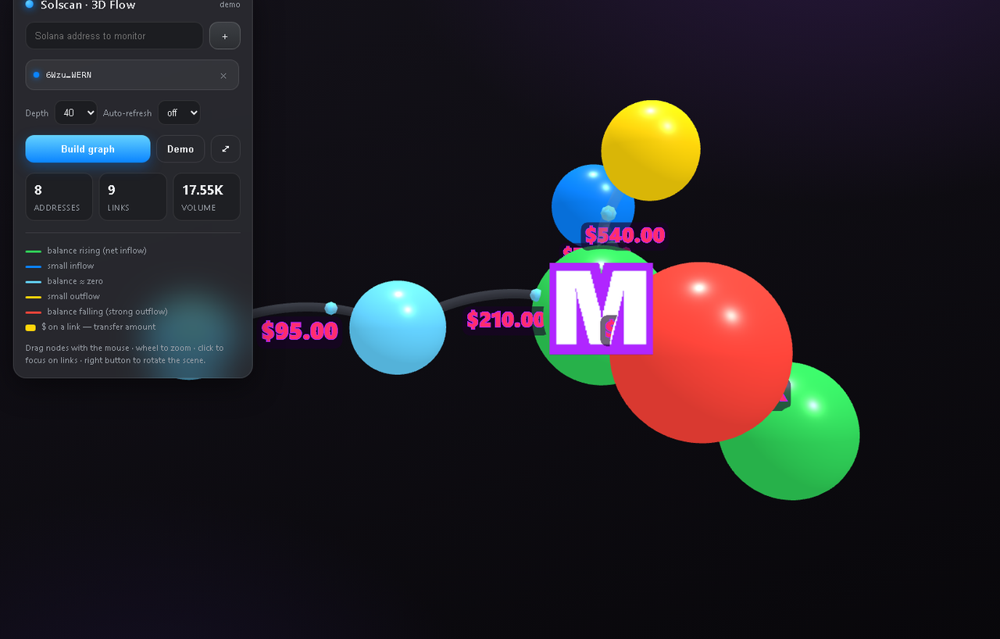

# Solscan 3D

A local toolkit for exploring fund flows on **Solana**: a CLI for the Solscan Pro API
plus an interactive **3D graph** of wallet-to-wallet relationships (who sent what to whom),
rendered in your browser. All API traffic goes through a local Python process — **your token
stays on the server and is never exposed to the browser**.




---

## What's inside

| File | Purpose |
|------|---------|
| `solscan.py` | CLI for the Solscan Pro API: transfers, DeFi activity, token metadata, transaction parsing, real-time wallet monitoring, CSV export. |
| `solscan_gui.py` | Local HTTP server + graphical interface: enter addresses → build a 3D flow graph. |
| `solscan_ui.html` | The interface itself (3D scene, form, address list). |
| `lib/` | Third-party JS libraries (three.js and others) — loaded locally, no CDN. |

---

## Requirements

- **Python 3.8+**
- The `requests` package (`pip install -r requirements.txt`)
- A **free Solscan Pro API key** — get one at <https://pro-api.solscan.io>

---

## Installation

```bash
git clone https://github.com/robinbobusa/solscan3d.git
cd solscan3d
pip install -r requirements.txt
```

## Token setup

The key is provided **only** through the `SOLSCAN_TOKEN` environment variable (there is no key in
the source code — this is intentional, so you never accidentally commit a secret).

**Windows (PowerShell):**
```powershell
$env:SOLSCAN_TOKEN="your_token"
```

**Linux / macOS:**
```bash
export SOLSCAN_TOKEN=your_token
```

---

## Usage

### 3D graph (GUI)

```bash
python solscan_gui.py
```

A browser opens at `http://127.0.0.1:8765/`. Enter one or more Solana addresses,
add them to the list and build the graph:

- **nodes** — addresses (monitored ones are highlighted);
- **edges** — aggregated `from → to` flows with animated direction;
- node size scales with volume, edge thickness with the transferred amount.

### CLI

```bash
# Wallet transfers
python solscan.py transfers So11111111111111111111111111111111111111112 -n 20

# DeFi activity (swaps, etc.)
python solscan.py defi <address> -n 20

# Token metadata and price
python solscan.py token EPjFWdd5AufqSSqeM2qN1xzybapC8G4wEGGkZwyTDt1v

# Transfers by token mint
python solscan.py ttransfers <token_mint>

# Parse a transaction by signature
python solscan.py tx <signature>

# Real-time wallet monitoring (+ sound, toasts, append to CSV)
python solscan.py watch <address> --interval 30 --notify --sound --csv out.csv

# Arbitrary call to any endpoint
python solscan.py raw account/transfer address=<addr> page_size=20
```

Most commands accept `--json` (raw JSON) or `--csv FILE` (export to CSV).

---

## ⚠️ Disclaimer

The software is provided **"AS IS"**, without warranty of any kind, express or implied, including
but not limited to the warranties of merchantability and fitness for a particular purpose (see the
full text in the [`LICENSE`](LICENSE) file).

- This project is **not affiliated** with, nor endorsed by, Solscan, the Solana Foundation, or any
  other third party.
- Data comes from a third-party API "as is" and may be incomplete or inaccurate. **This is not
  financial, investment, legal, or tax advice.**
- By using this tool you agree to comply with the
  [Solscan API terms of use](https://pro-api.solscan.io) and applicable law.
- The author is **not liable** for any loss, damage, or consequence arising directly or indirectly
  from use of this software. All responsibility for its use rests with the user.
- Use for lawful purposes only. Analyze on-chain data responsibly.

---

## License

Distributed under the **Apache License 2.0** — see [`LICENSE`](LICENSE) and [`NOTICE`](NOTICE).

Third-party libraries in `lib/` are distributed under their own licenses (MIT) — details in
[`NOTICE`](NOTICE).
